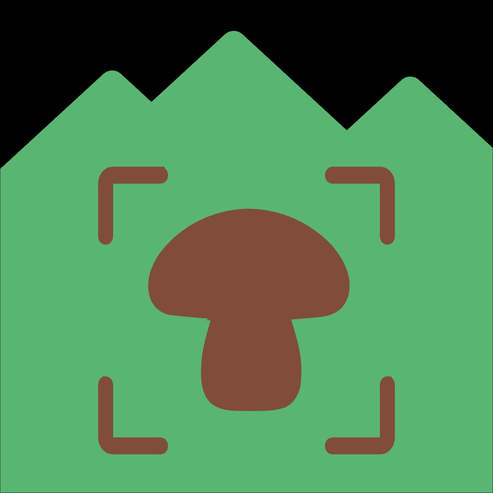

# 🍄 Micelio

<div align="center">
  
  
  **Your Personal Mushroom Identification and Tracking Companion**
  
  [](https://www.apple.com/ios/)
  [](https://swift.org)
  [](LICENSE)
  
  *Never miss a mushroom spot again* 🍄
</div>

**Micelio** is an iOS mushroom tracking and recognition application that helps mushroom enthusiasts identify, catalog, and track their fungal findings. The name "Micelio" means "mycelium" in Italian/Spanish, referring to the underground fungal network that connects mushrooms.

> ⚠️ **Note**: This app is currently not available on the App Store. See the [Build & Installation](#-build--installation) section below to install it on your device.

## ✨ Features

### 🗺️ Mappa (Map)
- **Interactive Location Tracking**: Mark and save mushroom locations with photos and notes
- **Smart Geofencing**: Receive notifications when you're near previously marked locations
- **Persistent Storage**: All your findings are stored locally using Core Data

### 🔍 Identifica (Recognize)
- **ML-Powered Recognition**: Identify mushrooms using on-device machine learning
- **Custom Trained Model**: Uses a specialized mushroom classifier (v6) trained on European species
- **Multiple Predictions**: Get ranked results with confidence scores
- **Privacy First**: All recognition happens on your device

### 📚 Catalogo (Catalog)
- **45+ Mushroom Species**: Comprehensive database of common European mushrooms
- **Detailed Information**: 
  - Scientific and common names
  - Edibility classification (edible, poisonous, toxic, inedible, conditional)
  - Habitat and environment details
  - Seasonal availability
  - Comprehensive descriptions
  - Fun trivia and facts
- **10 Images per Species**: 450+ high-quality mushroom photos
- **Advanced Filtering**: Filter by edibility, environment, and season
- **Flexible Grouping**: Organize mushrooms by different criteria

### 📅 MiCalendario (MiCalendar)
- **Weather-Based Forecasting**: Predicts optimal mushroom hunting days
- **Smart Evaluation**: Classifies days as Excellent, Good, Fair, or Poor based on:
  - Temperature
  - Humidity
  - Precipitation
  - Weather conditions
  - Moon phases
- **Location Management**: Save favorite locations and track recent searches
- **Automatic Location Detection**: Smart reverse geocoding to identify your area

## 🛠️ Technical Stack

- **Language**: Swift
- **UI Framework**: SwiftUI
- **Machine Learning**: Core ML with custom-trained mushroom classifier
- **Persistence**: Core Data
- **Location Services**: CoreLocation, MapKit
- **Notifications**: UserNotifications framework
- **Architecture**: MVVM with SwiftUI

## 🔒 Privacy & Security

- **No Data Collection**: Your data never leaves your device
- **Offline Capable**: Works without internet connection
- **Local Storage Only**: All mushroom findings, photos, and preferences stored locally
- **No Analytics**: No tracking or analytics whatsoever

## 📱 Platform Support

- iOS (iPhone and iPad)
- Requires iOS 15.0 or later

## 🚀 Build & Installation

Since the app is not yet available on the App Store, you can install it on your personal device using Xcode:

### Prerequisites

- **macOS** with Xcode 14.0 or later installed
- An **Apple Developer Account** (free account works for personal device installation)
- An **iOS device** running iOS 15.0 or later

### Installation Steps

1. **Clone the Repository**
 ```bash
 git clone git@github.com:Light2288/micelio.git
 cd micelio
 ```
   
2. __Open the Project in Xcode__
```bash
open Micelio.xcodeproj
```

3. __Configure Code Signing__

- In Xcode, select the `Micelio` project in the Project Navigator
- Select the `Micelio` target
- Go to the __Signing & Capabilities__ tab
- Under __Team__, select your Apple Developer account
- Xcode will automatically manage the provisioning profile

4. __Connect Your iOS Device__

- Connect your iPhone or iPad to your Mac via USB
- Unlock your device and trust the computer if prompted

5. __Select Your Device__

- In Xcode's toolbar, click on the device selector (next to the Run button)
- Choose your connected iOS device from the list

6. __Build and Run__

- Click the __Run__ button (▶️) or press `Cmd + R`

- Xcode will build the app and install it on your device

- First time: You may need to trust the developer certificate on your device:

- Go to __Settings__ > __General__ > __VPN & Device Management__
- Tap on your Apple ID
- Tap __Trust__

7. __Grant Permissions__

- When you first launch the app, grant the following permissions:

- __Location Services__: Required for map features and geofencing
- __Notifications__: Required for location-based alerts
- __Photos__: Required if you want to save mushroom photos

### Troubleshooting

- __"Failed to create provisioning profile"__: Make sure you're signed in with your Apple ID in Xcode (Preferences > Accounts)
- __"No provisioning profiles"__: Wait a few moments for Xcode to generate the profile automatically
- __Build errors__: Clean the build folder (Product > Clean Build Folder) and try again
- __App crashes on launch__: Check that your device meets the minimum iOS version requirement

## 📖 Usage

1. __Explore the Catalog__: Browse the mushroom database to learn about different species
2. __Identify Mushrooms__: Take a photo of a mushroom to get instant ML-based identification
3. __Mark Locations__: Save locations where you find mushrooms with photos and notes
4. __Check the Calendar__: Plan your mushroom hunting trips based on weather forecasts
5. __Get Notifications__: Receive alerts when you're near previously marked locations

## ⚠️ Disclaimer

__This app is for educational and recreational purposes only. Never consume wild mushrooms without expert identification. Some mushrooms are deadly poisonous. Always consult with a professional mycologist before consuming any wild mushroom.__

## 🤝 Contributing

Contributions are welcome! Please feel free to submit a Pull Request.

## 📧 Contact

For questions, issues, or feedback, please visit: [](https://light2288.github.io/micelio/)<https://light2288.github.io/micelio/>

## 📄 License

This project is licensed under the MIT License - see the [LICENSE](LICENSE) file for details.

Copyright (c) 2023 Davide Aliti

__Made with ❤️ for mushroom enthusiasts__
